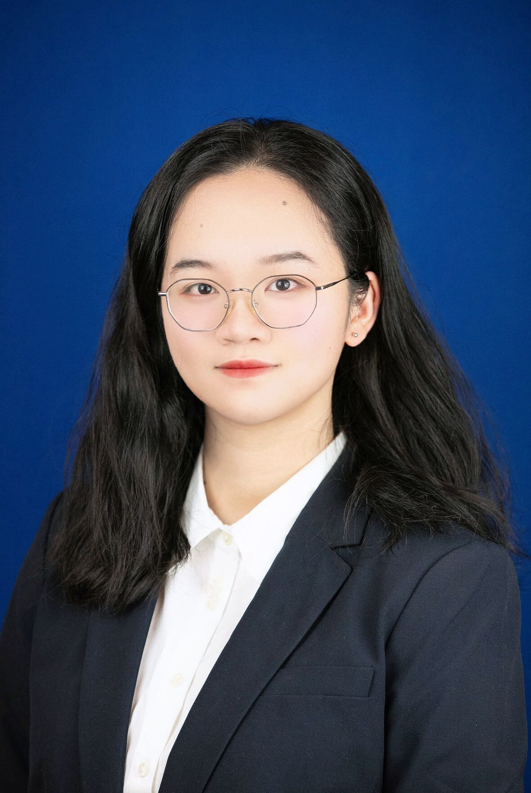

## Welcome !

{height=200}  

---

## About Me  

Hi! I’m **Xinyi Shang**, a second-year master’s student in the **Biostatistics Department** at **Columbia University**, specializing in the **Theory and Methods Track**.  

🔗 [View My Resume](resume.html)  
🔗 [Connect with Me on LinkedIn](https://www.linkedin.com/in/xinyi-shang-27a47026b/)  

---

## Research Interests  

I currently work in the [Wenpin Hou Lab](https://winnie09.github.io/Wenpin_Hou/), focusing on:  
- Evaluating GPT models for statistical applications.  
- Developing **statistical methods** for **spatial transcriptomics data**.  
